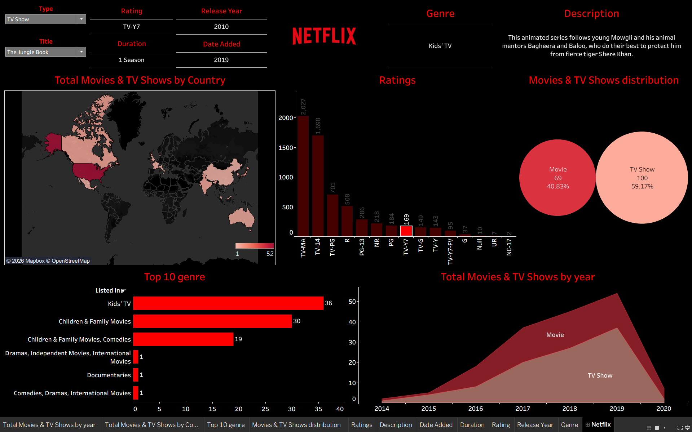

# 🎬 Netflix Movies & TV Shows Dashboard — Tableau

An interactive Tableau dashboard exploring the Netflix content catalog: what's on Netflix, where it comes from, how it's rated, and how the mix of Movies vs. TV Shows has grown over time.

🔗 **Live interactive dashboard:** [View on Tableau Public](https://public.tableau.com/app/profile/venuprasath.a/viz/NetflixDashboard_17882892897830/Netflix)

## 📊 What's in the dashboard

- **Total Movies & TV Shows by Country** — a world map showing where content originates
- **Ratings** — distribution of content across rating categories (TV-MA, TV-14, TV-PG, R, etc.)
- **Movies & TV Shows distribution** — overall split between Movies and TV Shows
- **Top 10 Genre** — most common genres/categories (Kids' TV, Children & Family Movies, etc.)
- **Total Movies & TV Shows by Year** — growth trend of content added over the years
- **Title lookup panel** — filter by Type and Title to see Rating, Release Year, Duration, Date Added, Genre, and Description for any individual show

## 🛠️ Built With

- [Tableau Public](https://public.tableau.com/) — dashboard design and visualization
- Netflix Titles dataset (Movies & TV Shows metadata)

## 📁 Repository Contents

| File | Description |
|---|---|
| `dashboard-preview.png` | Screenshot of the full dashboard |
| `data/netflix_titles.csv` | Source dataset used to build the dashboard |
| `README.md` | This file |

## 📈 Dataset

The dashboard is built on a Netflix titles dataset containing fields such as `type`, `title`, `director`, `cast`, `country`, `date_added`, `release_year`, `rating`, `duration`, `listed_in` (genre), and `description`.

## 👤 Author

Built by [venuprasath.a](https://public.tableau.com/app/profile/venuprasath.a) on Tableau Public.
